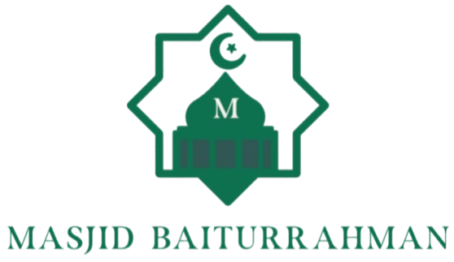
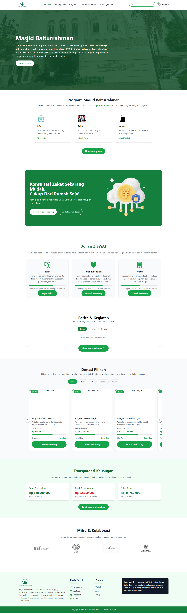

<<<<<<< HEAD
<p align="center">
  
</p>

<p align="center">
    <b>Masjid Baiturrahman</b>
</p>

## Daftar Isi
1. [Pendahuluan](#pendahuluan)
2. [Fitur](#fitur)
3. [Persyaratan](#persyaratan)
4. [Instalasi](#instalasi)
5. [Hasil Project](#hasil-project)

---

## Pendahuluan

Proyek ini adalah tugas Project Pengembangan Aplikasi Berbasis Multiplatform dengan tema Sistem Manajemen dan Transparansi Masjid Digital. Proyek ini dikembangkan oleh
1. Fadly Febro  
2. Alyazahra Dhia Faizah
3. Abdiel Rafif Elfairuz  

### Proyek ini bertujuan untuk memberikan contoh implementasi sistem perpustakaan yang mencakup pengelolaan data anggota, buku, dan peminjaman, dengan fitur autentikasi dan role-based access.
Project Kami Menggunakan Laravel dan Bootstrap:

<div style="display: flex; justify-content: space-evenly; align-items: center; gap: 20px; margin-top: 20px;">
  <a href="https://laravel.com" target="_blank">
    
  </a>
  <a href="https://getbootstrap.com/" target="_blank">
    
  </a>
</div>

---

## Fitur

Proyek ini memakai tiga role. Setiap role punya fitur sesuai kebutuhan dari user story.

### Role Jamaah

* **Daftar Akun**: Membuat akun untuk menyimpan riwayat donasi.
* **Login**: Masuk dengan email dan password yang di-hash.
* **Donasi Tanpa Login**: Melakukan donasi langsung tanpa autentikasi.
* **Informasi Kegiatan**: Melihat jadwal dan program masjid.
* **Jenis Donasi**: Memilih zakat, infak, sedekah, atau wakaf.
* **Laporan Kas**: Melihat grafik kas masuk dan keluar.
* **Ekspor Donasi**: Mengunduh laporan donasi pribadi ke PDF.
* **Notifikasi**: Menerima pemberitahuan donasi berhasil atau kegiatan baru.
* **Berita dan Pengumuman**: Mengakses informasi terbaru dari masjid.

### Role Admin

* **Login Admin**: Akses khusus untuk pengelolaan sistem.
* **Profil Masjid**: Kelola alamat, media sosial, dan struktur DKM.
* **Program Masjid**: Menambah dan mengedit kegiatan.
* **Berita dan Pengumuman**: Mengunggah informasi terbaru.
* **Laporan Donasi**: Melihat laporan donasi real time.
* **Transaksi Donasi**: Memantau donasi otomatis dari Midtrans.
* **Akun Finance**: Menambah akun khusus pengelolaan keuangan.
* **Kategori Donasi dan QRIS**: Mengatur kategori donasi.
* **Ekspor Laporan**: Mengunduh laporan PDF.
* **Log Aktivitas**: Melihat catatan aktivitas sistem.
* **Keamanan Login**: Mengatur session timeout dan cookie.

### Role Finance

* **Login Finance**: Akses khusus pencatatan keuangan.
* **Pencatatan Kas**: Mencatat pemasukan dan pengeluaran.
* **Sumber Dana**: Menambah kategori dana seperti ZISWAF atau kemitraan.
* **Pengeluaran Rutin**: Mencatat biaya operasional.
* **Laporan Keuangan**: Melihat laporan mingguan dan bulanan dalam grafik.
* **Integrasi Midtrans**: Mencatat donasi otomatis dari Payment Gateway.
* **Ekspor PDF**: Mengunduh laporan keuangan.
* **Notifikasi**: Menerima pemberitahuan transaksi baru.
* **Log Aktivitas Keuangan**: Memantau perubahan data.

---

## Persyaratan

Untuk menjalankan proyek ini, Anda memerlukan:
- **XAMPP**: Untuk server lokal dan database MySQL.  
- **Composer**: Untuk mengelola dependensi PHP.  
- **Git**: Untuk meng-clone repository dari GitHub.
- **Herd**: untuk menjalankan PHP dan Laravel dengan setup lokal yang lebih cepat

---

## Instalasi

Ikuti langkah-langkah berikut untuk menjalankan proyek ini di komputer Anda:

1. **Clone repository:**
   ```bash
   git clone <repository-url>
   cd <nama-folder-repository>
   ```

2. **Install dependencies menggunakan Composer:**
   ```bash
   composer install
   ```

3. **Salin file `.env.example` menjadi `.env`:**
   ```bash
   copy .env.example .env
   ```

4. **Generate application key:**
   ```bash
   php artisan key:generate
   ```

5. **Update dependencies dengan Composer (opsional, jika diperlukan):**
   ```bash
   composer update
   ```

6. **Konfigurasi file `.env`:**
   Edit bagian berikut:
   ```
   DB_CONNECTION=mysql
   DB_HOST=127.0.0.1
   DB_PORT=3306
   DB_DATABASE=db_masjid
   DB_USERNAME=root
   DB_PASSWORD=
   ```
   **Tambahkan Konfigurasi file `.env`:, untuk mereset password**
   ```
   MAIL_MAILER=smtp
   MAIL_HOST=smtp.gmail.com
   MAIL_PORT=587
   MAIL_USERNAME=starseed768@gmail.com
   MAIL_PASSWORD=gihrelujvphghnmi
   MAIL_ENCRYPTION=tls
   MAIL_FROM_ADDRESS=starseed768@gmail.com
   MAIL_FROM_NAME="Masjid Baiturrahman"
   ```

7. **Tambahkan database di phpMyAdmin:**
   - Masuk ke phpMyAdmin.
   - Buat database baru dengan nama `db_masjid`.

8. **Jalankan migration untuk membuat tabel di database:**
   ```bash
   php artisan migrate
   ```

9. **Jalankan server Laravel:**
   ```bash
   php artisan serve
   ```

10. **Akses aplikasi di browser:**
    Buka URL berikut di browser Anda:  
    [http://127.0.0.1:8000](http://127.0.0.1:8000)
Jika Kamu memakai Herd. Ikuti langkah ini.
• Pastikan Herd sudah aktif.
• Letakkan folder proyek di dalam folder Sites milik Herd.
• Herd akan membuat domain otomatis dengan format
nama-folder-proyek.test
• Buka alamat itu di browser.
Contoh
masjid-resik.test

---

## Hasil Project

Berikut adalah beberapa tampilan dari hasil project:


=======
# masjid-baiturrahman
>>>>>>> 205b9639a63340fb2b1eb97b061eaec49c1d377e
